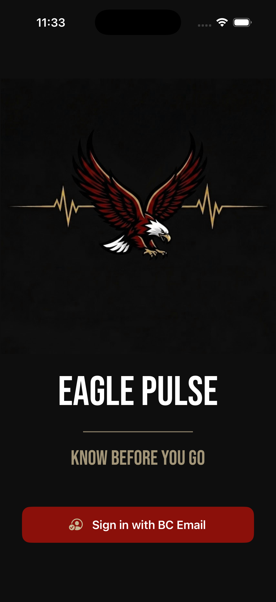
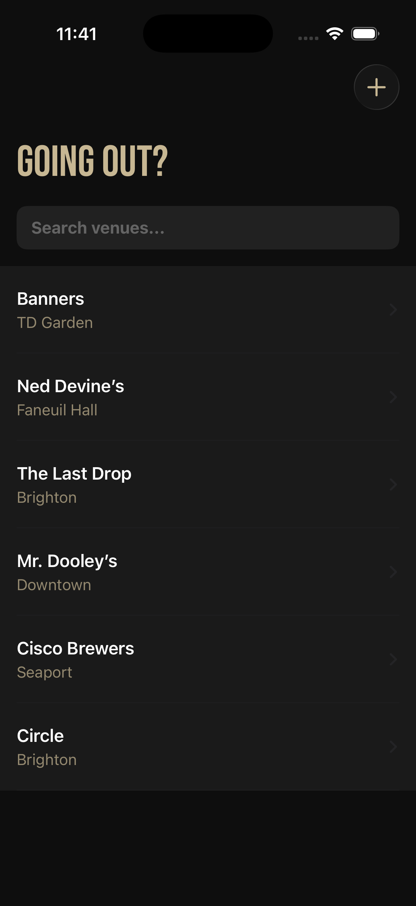
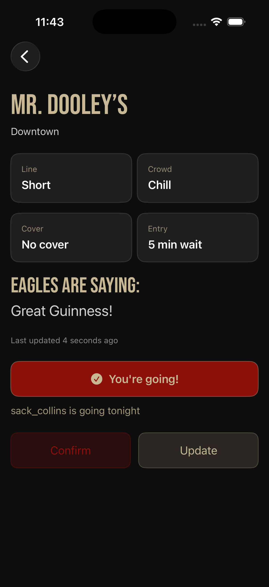
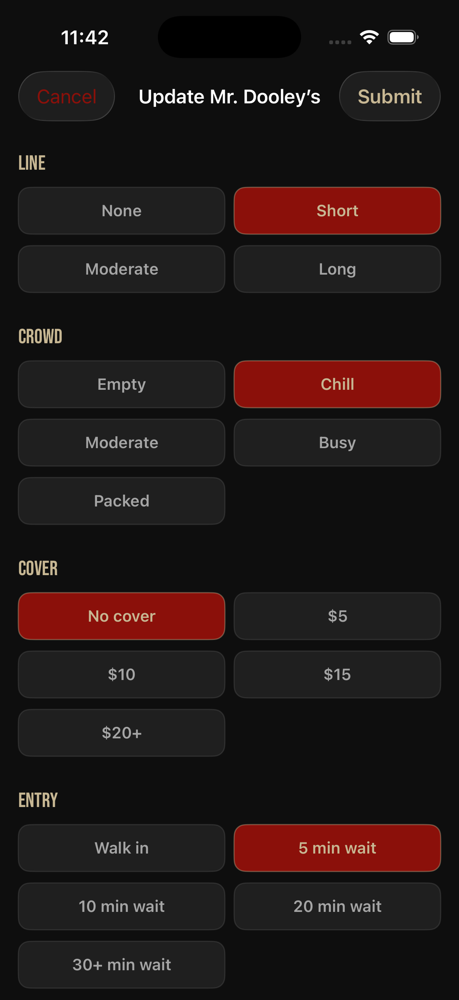
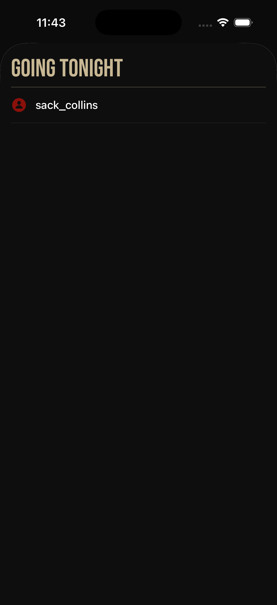
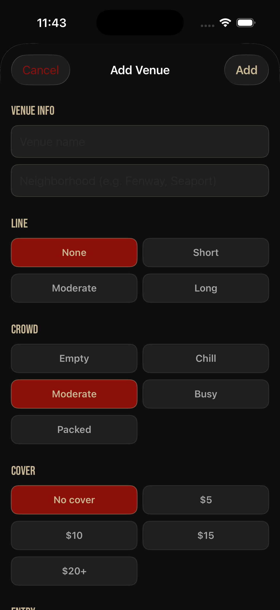

# 🦅 Eagle Pulse
A real-time bar and venue tracker built exclusively for Boston College students. Know the line, crowd, cover, and entry status at BC-area bars before you leave — and see which of your friends are heading out tonight.

## About
Eagle Pulse is a SwiftUI iOS app that lets BC students check live venue status updates, mark themselves as "going tonight", and see who else is heading out. Authentication is restricted to @bc.edu Google accounts only.

## Demo

Demo walkthrough of Eagle Pulse — covers BC email login, username setup, browsing venues, marking yourself as going, updating venue status, and adding a new venue.

## Screenshots

  
  
  
  
  
  

## Technologies Used
- **SwiftUI** — UI framework for all views and navigation
- **Firebase Authentication** — Google Sign-In restricted to @bc.edu accounts
- **Cloud Firestore** — Real-time NoSQL database for venue data and social features
- **Firestore Subcollections** — Used to store nightly "going" data per venue
- **Persistent Login** — `addStateDidChangeListener` for seamless session restoration
- **Custom Font** — Bebas Neue integrated via Info.plist
- **Custom Color Palette** — BC maroon and gold throughout via Assets.xcassets
- **Reusable SwiftUI Components** — `OptionSection`, `StatusTile`, `GoingUsersView`
- **Daily Reset Logic** — Venue status and going list reset each night automatically
- **Swift Package Manager** — Firebase iOS SDK dependency management

## Contact
- 📧 [necollins03@gmail.com](mailto:necollins03@gmail.com)
- 💼 [LinkedIn](https://linkedin.com/in/nicholas-collins-622946261)
